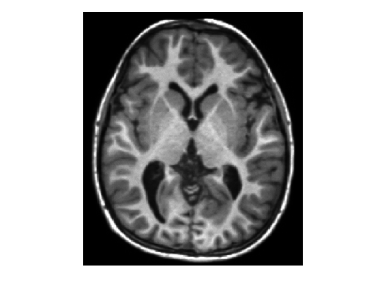

# PatchCreator



PatchCreator can be used to create patches from large 2D or 3D data. This can be useful for certain Machine Learning tasks, whenever it is not possible to e.g. predict the complete image at once, because it would require too much GPU memory. 

You can adjust the minimum overlap that these patches should have as well. Note that an overlap can help to avoid artifacts, if the patches are recombined again.
If the patches are recombined, the algorithm weights the borders of each patch less strongly than their center, to avoid further border artifacts of each patch.

An example is provided with the file example.py.

To install the package, run the following command in this directory:

```
pip install . 
```

